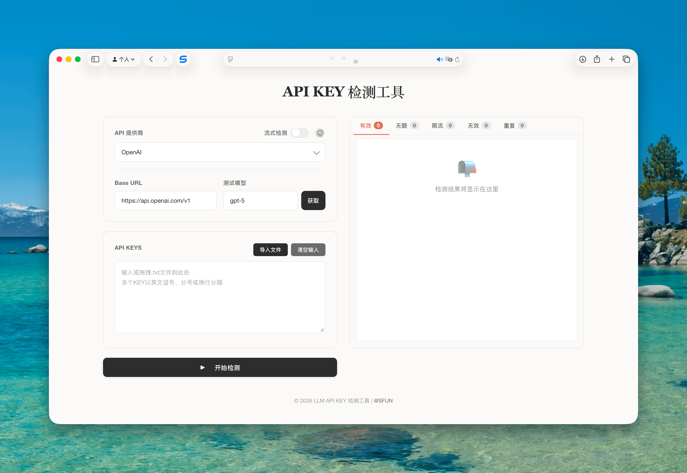
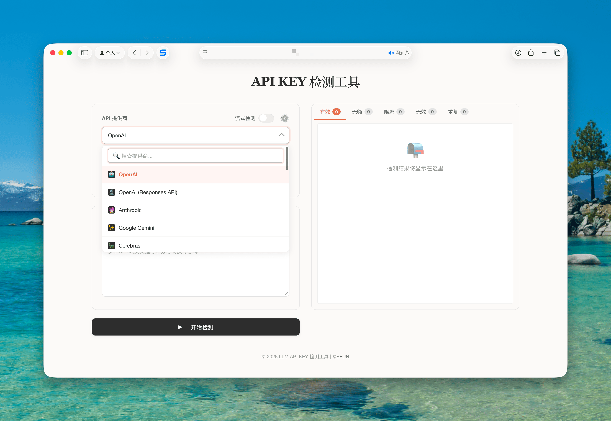
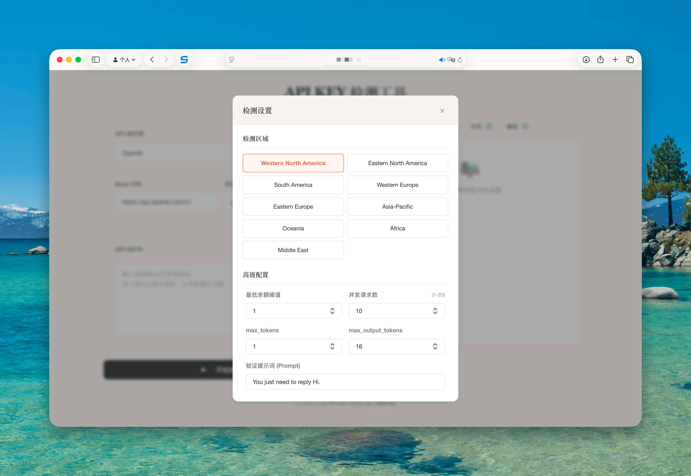
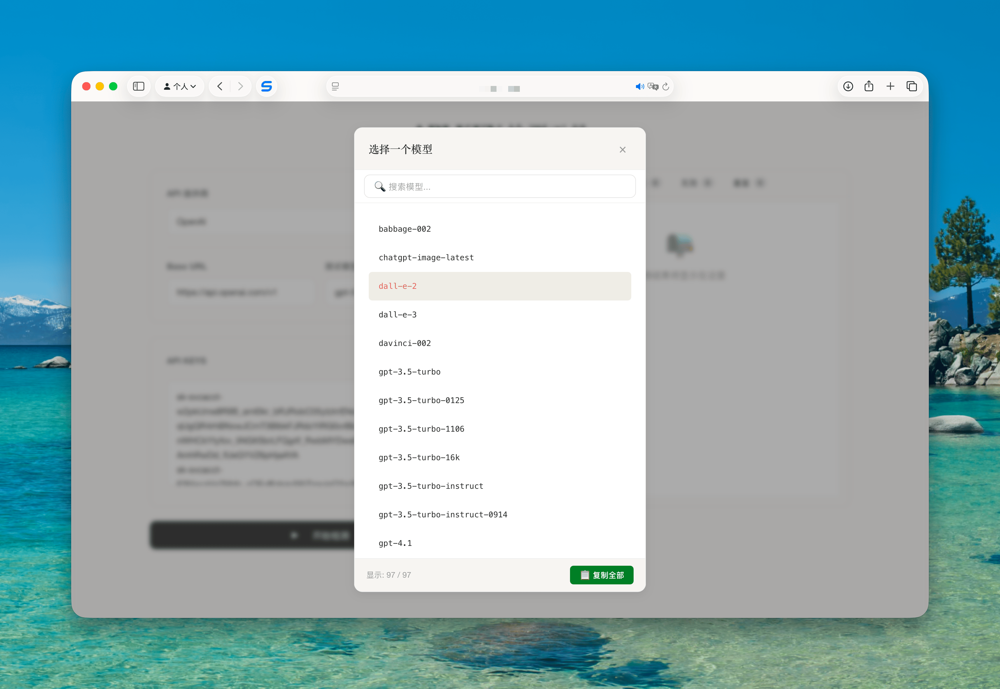

# LLM API Key Checker


[](https://deploy.workers.cloudflare.com/?url=https://github.com/ssfun/llm-api-key-checker)

一个功能强大的 LLM API 密钥批量检测工具，支持多个主流 LLM 提供商的密钥验证和余额查询。

## ✨ 主要特性

- 🔑 **批量检测** - 支持同时检测多个 API 密钥，最多支持 50,000 个
- 🏢 **多平台支持** - 兼容 OpenAI、Anthropic、Google Gemini、DeepSeek、Moonshot、通义千问、智谱 AI 等主流平台
- 💰 **余额查询** - 精确查询每个有效密钥的余额信息
- 🌍 **区域选择** - 支持不同地区的服务器节点选择
- 📊 **实时进度与反馈** - 基于 WebSocket 的实时数据流，提供精确进度和即时状态更新
- 🎯 **智能分类** - 自动将密钥分类为有效、低额、零额、无效等状态
- 🚀 **高性能与任务控制** - 后端集中管理并发任务，支持暂停、继续、停止操作
- 💡 **智能模型获取** - 自动遍历多个 Key 尝试获取模型列表，直至成功或全部失败
- 🔍 **精细错误展示** - 优化错误信息优先级，优先展示 `reason`、`code` 等更具体信息
- 📁 **文件导入** - 支持拖拽或选择 .txt 文件导入，带进度显示
- 💻 **响应式设计** - 完美适配桌面端和移动端

## 🖥️ 界面预览






## 🏗️ 技术架构

### 前端技术栈
- **Vue 3** - 采用 Composition API 的现代前端框架
- **Pinia** - 轻量级状态管理库
- **Vite** - 快速的构建工具和开发服务器
- **CSS3** - The Anthropic Aesthetic 设计系统，温暖人文的视觉风格
- **vue-virtual-scroller** - 高性能虚拟滚动，支持大批量数据展示

### 后端技术栈
- **Cloudflare Workers** - 无服务器边缘计算平台
- **Durable Objects** - 用于区域代理和状态管理，由主 Worker 协调
- **WebSocket** - 实时双向数据流传输，替代传统 SSE
- **现代 JavaScript** - 采用 ES6+ 语法和异步编程

## 🚀 快速开始

### 环境要求
- Node.js 18.0 或更高版本
- npm 或 yarn 包管理器
- Cloudflare 账户（用于部署）

### 安装步骤

1. **克隆项目**
   ```bash
   git clone https://github.com/your-username/llm-api-key-checker.git
   cd llm-api-key-checker
   ```

2. **安装依赖**
   ```bash
   npm install
   ```

3. **配置环境**
   
   复制并编辑配置文件：
   ```bash
   cp wrangler.toml.example wrangler.toml
   ```
   
   在 `wrangler.toml` 中配置以下变量：
   ```toml
   [vars]
   ALLOWED_ORIGINS = "[\"https://your-domain.com\"]"
   ENABLE_UA_RANDOMIZATION = "true"
   ENABLE_ACCEPT_LANGUAGE_RANDOMIZATION = "true"
   ```

4. **开发环境运行**
   ```bash
   npm run dev
   ```

5. **构建项目**
   ```bash
   npm run build
   ```

6. **部署到 Cloudflare Workers**
   ```bash
   npm run deploy
   ```

## 📖 使用指南

### 基本使用

1. **选择服务商** - 从下拉菜单中选择要检测的 LLM 提供商
2. **配置 API** - 输入对应的 Base URL 和选择模型
3. **输入密钥** - 在文本框中输入要检测的 API 密钥（支持批量输入）
4. **开始检测** - 点击"开始检测"按钮启动验证流程
5. **查看结果** - 实时查看检测结果和详细信息

### 任务控制

- **开始检测**：启动新的检测任务。
- **暂停检测**：暂停当前正在进行的检测，任务状态会保留。
- **继续检测**：从暂停处恢复检测任务。
- **停止检测**：终止当前检测任务，并清空所有进度和结果。

### 支持的服务商

| 服务商 | 状态 | 余额查询 | 模型列表 |
|--------|------|----------|----------|
| OpenAI | ✅ | 🙅‍♂️ | ✅ |
| Anthropic Claude | ✅ | 🙅‍♂️ | ✅ |
| Google Gemini | ✅ | 🙅‍♂️ | ✅ |
| DeepSeek | ✅ | ✅ | ✅ |
| Moonshot | ✅ | ✅ | ✅ |
| 通义千问 | ✅ | 🙅‍♂️ | ✅ |
| 智谱 AI | ✅ | 🙅‍♂️ | ✅ |
| Groq | ✅ | 🙅‍♂️ | ✅ |
| NewApi | ✅ | ✅ | ✅ |

### 密钥输入格式

支持多种输入格式：
```
sk-1234567890abcdef
sk-1234567890abcdef, sk-abcdef1234567890
sk-1234567890abcdef;sk-abcdef1234567890
```

### 结果分类

- **有效** - 密钥有效且余额充足
- **低额** - 密钥有效但余额低于设定阈值
- **零额** - 密钥有效但余额为零
- **无额** - 密钥有效但配额已用完
- **限流** - 密钥有效但当前受到频率限制
- **无效** - 密钥无效或已过期
- **重复** - 输入列表中的重复密钥

## ⚙️ 配置说明

### 高级设置

- **最低余额阈值** - 设置低额密钥的判断标准
- **并发请求数** - 控制后端同时进行的请求数量（1-20）
- **检测区域** - 选择不同地区的服务器节点

### 安全特性

- **CORS 保护** - 严格的跨域访问控制
- **URL 验证** - 防止 SSRF 攻击
- **UA 随机化** - 随机 User-Agent 避免检测
- **请求频率控制** - 内置限流机制

## 📁 项目结构

```
llm-api-key-checker/
├── src/                          # Cloudflare Workers 后端
│   ├── index.js                  # 主入口文件，路由处理
│   ├── checkers.js               # 密钥验证核心逻辑
│   ├── websocket_handler.js      # WebSocket 会话及任务管理
│   ├── model_fetchers.js         # 模型列表获取
│   └── utils/
│       ├── fetcher.js            # HTTP 请求工具
│       ├── security.js           # 安全验证
│       ├── userAgent.js          # UA 随机化
│       └── cors.js               # CORS 处理
├── frontend/
│   ├── src/
│   │   ├── main.js               # 应用入口
│   │   ├── App.vue               # 根组件
│   │   ├── api.js                # API 调用封装
│   │   ├── assets/
│   │   │   └── main.css          # 全局样式
│   │   ├── stores/
│   │   │   ├── config.js         # 配置状态
│   │   │   ├── results.js        # 结果状态
│   │   │   ├── checker.js        # 检测状态
│   │   │   └── ui.js             # UI 状态
│   │   └── components/
│   │       ├── modals/
│   │       └── ...               # 其他组件
│   ├── dist/
│   └── package.json              # 前端依赖
├── wrangler.toml                 # Cloudflare 配置
└── package.json                  # 项目依赖
```

## 🔧 开发指南

### 本地开发

1. **启动前端开发服务器**
   ```bash
   npm run dev
   ```

2. **启动后端模拟**
   ```bash
   npx wrangler dev
   ```

### 添加新的服务商

1. 在 `src/checkers.js` 中添加新的检查器策略
2. 在 `src/model_fetchers.js` 中添加模型获取逻辑
3. 在 `config/providers.json` 中更新服务商配置

### 自定义样式

- 修改 `frontend/src/assets/main.css` 中的 CSS 变量
- 所有样式都使用 CSS 自定义属性，便于主题定制

## 🤝 贡献指南

我们欢迎任何形式的贡献！

1. **Fork** 本项目
2. **创建** 特性分支 (`git checkout -b feature/AmazingFeature`)
3. **提交** 更改 (`git commit -m 'feat: Add some AmazingFeature'`)
4. **推送** 分支 (`git push origin feature/AmazingFeature`)
5. **创建** Pull Request

### 开发规范

- 代码已进行全面注释和格式化，请保持一致
- 提交信息使用 [Conventional Commits](https://www.conventionalcommits.org/) 格式
- 确保所有测试通过后再提交 PR

## 📝 更新日志

### v2.0.0
- 全新 Vue 3 + Composition API 架构
- 将核心检测逻辑从 SSE 迁移至 WebSocket，实现后端集中任务管理
- 支持区域代理
- 全新的响应式 UI 设计
- 支持更多 LLM 提供商
- 新增暂停、继续、停止检测任务的功能
- 优化模型获取逻辑，支持遍历多个 Key 尝试获取
- 完善的移动端适配

### v1.0.0
- 初始版本发布
- 基础密钥检测功能
- 支持 OpenAI 和 Anthropic

## 🛡️ 安全说明

- 本工具仅用于验证自己拥有的 API 密钥
- 请勿用于非法用途或未经授权的密钥检测
- 所有检测数据仅在当地处理，不会上传到第三方服务器
- 建议在本地环境中使用，避免在公共场所使用

## 📄 许可证

本项目采用 MIT 许可证 - 查看 [LICENSE](LICENSE) 文件了解详情。

## 🙏 致谢

- [Vue.js](https://vuejs.org/) - 渐进式 JavaScript 框架
- [Cloudflare Workers](https://workers.cloudflare.com/) - 无服务器边缘计算平台
- [Pinia](https://pinia.vuejs.org/) - Vue.js 状态管理库
- [Vite](https://vitejs.dev/) - 下一代前端构建工具

## 📞 联系我们

- 🐛 **问题反馈**: [GitHub Issues](https://github.com/ssfun/llm-api-key-checker/issues)
- 💬 **功能建议**: [GitHub Discussions](https://github.com/ssfun/llm-api-key-checker/discussions)

---

⭐ 如果这个项目对您有帮助，请考虑给我们一个 Star！
